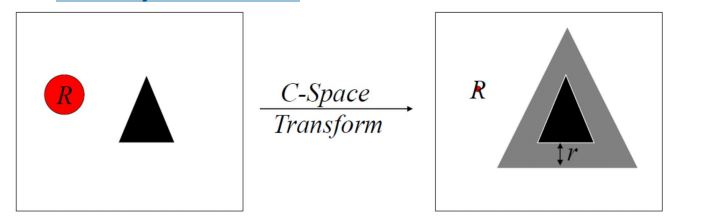
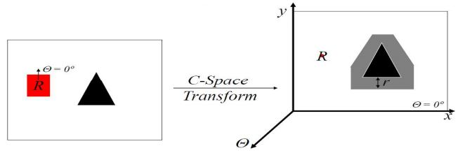
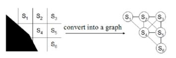
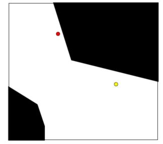
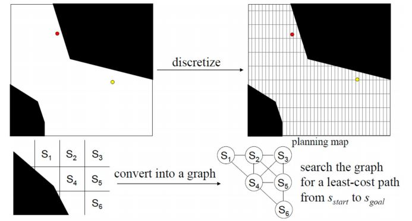
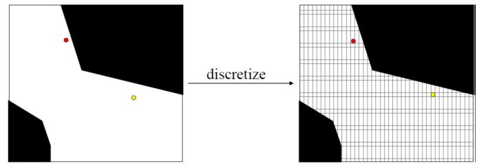
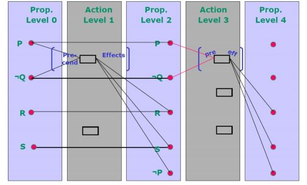

# Planning Graphs and Heuristic Search

## Space

### Configuration Space

* Configuration is legal if it does not intersect any obstacles and is valid
* Configuration Space is the set of legal configurations

### C-Space Transform

**2D object :**

Configuration space for rigid-body objects in 2D world is:

* 2D if object is circular.

  

* expand all obstacles by the radius of the object r 
* planning can be done for a point R (and not a circle anymore)

* **Advantage**: planning is faster for a single point 
* **Disadvantage**: need to expand obstacles every time 

**3D object:**

Configuration space for rigid-body objects in 2D world is:

* 3D if object is non-circular

* **Advantage**: planning is faster for a single point 
* **Disadvantage**: constructing C-space is expensive

## Graph construction

* Cell decomposition
  * X-connected grids
  * Lattice-based graphs

* Skeletonization of the environment/C-Space
  * Visibility graphs
  * Voronoi diagrams
  * Probabilistic roadmaps

## Planning via Cell Decomposition

* Exact Cell Decomposition:
  *  overlay convex exact polygons over the free C-space 
  * construct a graph, search the graph for a path 
  * overly expensive for non-trivial environments and/or above 2D

* Approximate Cell Decomposition:
  * Overlay uniform grid over the C-space (discretize)

* Exact and Approximate Cell Decomposition:
  * construct a graph and search it for a least-cost path 
    *  VERY popular due to its simplicity 
      * expensive in high-dimensional spaces construct the grid on-the-fly, i.e. while planning – still expensive

**Exercise example**

See Slide 13 

## Graph Plan

A propositional planer , that is ,there are no variables.

* Assertions Simpler - don't have to worry about matching
* Bigger - If you have six blocks , you need 36 propositions to represent all On(x,y). 

**Steps**:

1. Make a plan graph of depth k
2. Search for a solution
3. If succeed, return a plan
4. Else k = k+1
5. Go to 1

### Making the Plan Graph

* Start with initial conditions
* Add actions with satisfied preconditions
* Add all effects of actions at previous levels
* Add maintenance actions

### Graph plan One-Way Rocket Domain

**Blum & Furst 95** 

* Pre-processing before engaging in search. 
* Forward search combined with backward search. 
* Construct a planning graph to reveal constraints 
* Two stages: 
  * Extend: One time step in the planning graph. 
  * Search: Find a valid plan in the planning graph. 
* Graph plan finds a plan or proves that no plan has fewer “time steps

**Actions**

To create an action-level i: 

*  Add each instantiated operator, for which all of its preconditions are present at proposition level i AND no two of its preconditions are exclusive. 
*  Add all the no-op actions. 
  * Determine the exclusive actions. 

To create a proposition-level i + 1: 

* Add all the effects of the inserted actions at action-level i - distinguishing add and delete effects. 
* Determine the exclusive actions. 

---

* A literal may exist at level i + 1 if it is an Add-Effect of some action in level i. 
* Two propositions p and q are exclusive in a proposition level if ALL actions that add p are exclusive of ALL actions that add q. 
* Actions A and B are exclusive at action-level i, if: 
  * Interference: A (or B) deletes a precondition or an Add-Effect of B (or A).
  * Competing Needs: p is a precondition of A and q is a precondition of B, and p and q are exclusive in proposition-level i - 1

