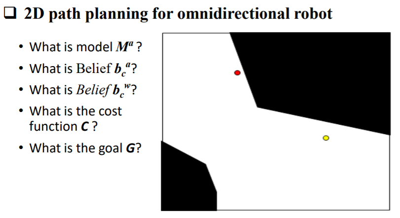
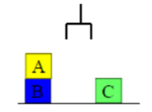
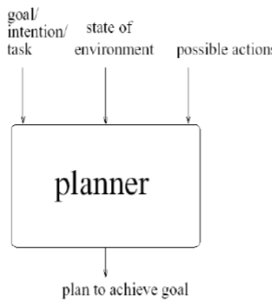

# Planning

**What is?**

Planning is the process of thinking (actions) about an organizing the activities required to achieve a desired goal.

**Planning example**

Cost Function quantifies the error between predicted values and expected values and presents it in the form of a single real number. Depending on the problem Cost Function can be formed in many different ways Minimized (loss) and Maximized (reward)

## Continious vs Discrete vs Hybrid Model

**Planning vs controller**

Plans are always formulated for future and determine the future course of action for the achievement of objectives laid down. On the contrary, controlling is looking back because under it a manager tries to find out, after the work is completed, whether it has been done according to the standards or not. It is thus clear that p

## Problem Solving

Planning - Problem Solving

* Given the actions available in a task domain.
* Given a problem specified as:
  * an initial state of the world
  * goal statement - a set of goals to be achieved
* Find a solution to the problem
  * a way to transform the initial state into a new state of the world where the goal statement is true.
* Planning is "thinking..."

To represent the environment we need an Ontology (logical). In philosophy, ontology is the study of what exists in the enviroment. In AI, an ontology is a specification of the meanings of the symbols in an information system.

### State Representation = Environment

A representation of one of the blocks world. We use the closed world assumption: anything not stated is assumed to be false.

### Goal representation

A goal is represented as a set of formulae. 

For example in this game we can define the goal as all blocks are in table so the representation of goal is:

OnTable(A) OnTable(B) OnTable(C)

### Define Actions

Actions are represented using a technique that was developed in the STRIPS planner. Each action has:

* a name -- wich may have arguments
* a preconditions
* a delete list: a list of facts that are no longer true after action is performed
* an add list that are a list of facts made true by executing the action.

## Planning and Agents

Means-End Reasoning

* Idea is to give an agent:
  * representation of goal to achieve.
  * representation of actions it can perform
  * representation of the environment
* Then have the agent can generate a plan to achieve the goal. The entirely plan is generated by planning system without human intervention

\pagebreak

## STRIPS Planning

Two additional data structures:

* State List : All currently true predicates
* Goal Stack: a push down stack of goals to be solved with current goal on top of stack.

If current goal is not satisfied by present state

* Find goal in the add list of an operator, and push operator and preconditions list on stack (subgoals)

When a current goal is satisfied, POP it from stack.

When an operator is on top of the stack

* update the plan sequence and use the operators add and delete lists to update the current state

Means - ends reasoning are :

* Means = actions
* goals = ends

The states of the world and goals are represented as set/list of predicates that are true.

If the top item on the goal stack is:

* Empty return the actions executed (they form the plan to achieve the goal)
* a goal , and it is satisfied in the current state , remove it from stack
* a complex goal, break it into subgoals and placing all subgoals on the goal stack. 
* a predicate, find the action that will make it true, then place that action and its preconditions on the goal stack (preconditions first)
* an action and its preconditions are satisfied , perform the action updating the world state using the delete and add lists of the action. Add this action to the partial plan.

Two approaches to build a plan:

* Forward state space search (goal progression) – Start from what is known in the initial state and apply operators in the order they are applied
* Backward state space search (goal regression) – Start from the description of the goal and identify actions that help to reach the goal

Advantage: 

* Leads to more efficient planning algorithms.
* State-space search with structured representations of states, actions and goals.
* Action representation avoids the frame problem

Disadvantages:

* They cannot take advantage of the problem decompositions in which the goal we want to reach consists of a set of independent or nearly independent subgoals
* Action sequences cannot be built from the middle
* No mechanism to represent least commitment in terms of the action ordering

## Goal interaction

* Simple planning algorithms assume that the goals to be achieved are independent. Each can be solved separately and the solutions concatenated.

