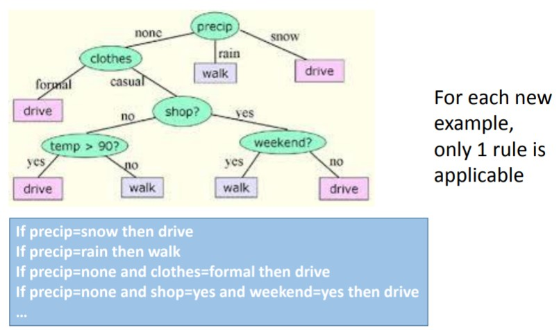
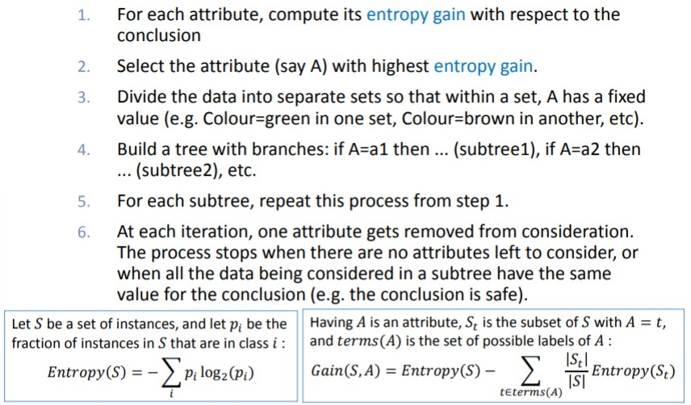
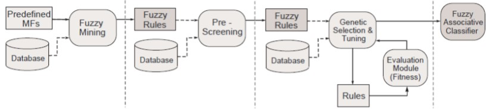
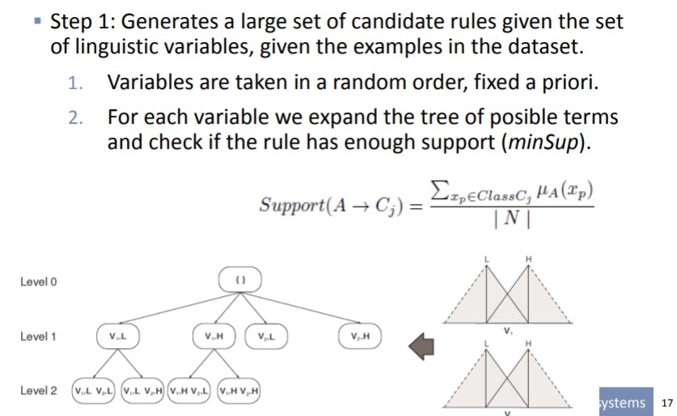

# Supervised learning in fuzzy expert systems

**Fuzzy-ID3**

* This learning method follows the classic crisp learning method called ID3.
* It constructs a decision tree from where the leaves correspond to different values of the output variable.
* Intermediate nodes check the values of one of the input variables to follow different branches.

For a new example: The output is a degree of membership to the output classes.

**Algorithm**

## Induction based on ambiguity

* Select the best attribute for the root node v: the one with smallest classification ambiguity
* Create a new branch for the values of variable v for which we have examples with support at least &alpha;
* Calculate the truth level of classifying all objects within a branch into each class.
*  If the truth level is above &beta; for one of the classes ci , terminate the brach with as a leave with label ci.
* If truth level is smaller than &beta; for all classes, check if an additional attribute will further reduce the classification ambiguity.
* If yes, select the attribute with smallest classification ambiguity as a new decision node from the branch.
* If not, terminate the branch as a leaf with label corresponding to the class with the highest truth level.
* Repeat until no further growth is possible.

### Control parameters

The significant level &alpha;: an object belongs to a branch only when the corresponding membership is greater than &alpha;. This parameter filters insignificant evidences, therefore eliminating insignificant branches.

The truth level threshold &beta;: it is used to decide when a branch ends. Thus, it controls the growth of the tree. Lower &beta; may lead to a smaller tree but with lower classification accuracy.

## FARC-HD: genetic rule selection

**Note**: This method does not follow ID3 approach.

**Steps**:

1. Generates a large set of candidate rules given the set of linguistic variables, given the examples in the dataset.
2. A pre-screening of the candidate rules is made to select the best ones.
3. A genetic algorithm is used to tune the parameters.

Step 2: A pre-screening of the candidate rules is made to select the best ones.

* The quality of each rule is evaluated taking into account the number of covered examples. The rule that covers more examples is selected.
* Each example has a value that decreases when it is covered by a selected rule. This value is used to evaluate the quality of rules in the next step. So that, if the rule is covering examples that are already covered, they have less weight.
* The goal is to select a minimal subset of rules that cover different examples.

Step 3: A genetic algorithm is used to tune the parameters.

* The rules work with the 2- tuple model of fuzzy sets 
* They select the best rules with genetic optimization. 
* At the same time, they find the value of displacement for each label in the premises of each rule using optimization

# Unsupervised fuzzy clustering

A data mining method consisting in automatically construct a partition of the objects in disjoint group. Classic methods work with crisp data: bottom-up (agglomerative) or top-down (partitioning). A well-known and simple partitioning method is kmeans. Fuzzy versions have also been developed, like fuzzy cmeans.

### K-means

1. Determine K initial centroids.
2. Find the nearest centroid to each object.
3. Recalculate the centroid for each cluster. 
4. Repeat the steps 2 & 3 until convergence

### Fuzzy c-means

1. Determine the *c* initial centroids
2. Calculate the membership degree of each object to each class.
3. Recalculate the centroid of each cluster using an weighted averaging operator.
4. Repeat steps 2 & 3 until convergence. 

**Notes**:

* In fuzzy c-means we have an additional parameter: m that indicates the degree of fuzziness of the clusters to construct. 
  * m = 1 crisp clusters, m > 1 fuzzy clusters.
* This parameter is used in step 2 for calculate the membership degree to a cluster and step 3 for recalculate centroids.