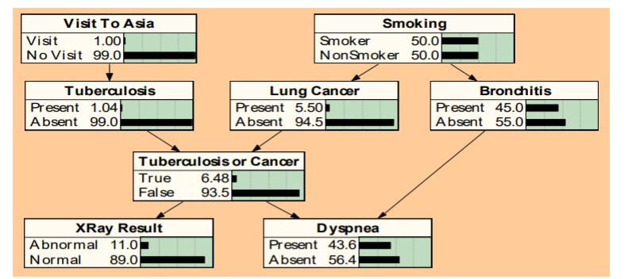

# Bayesian Networks

Bayesian nets are a network-based framework for representing and analyzing models involving uncertainty.

Are interesting for:

* Graphical interpretation which facilitates the understanding.

* Availability of easy to use commercial software.

* Growing number of creative applications.

  

Bayesian Network is an acyclic graph.

Each node is an uncertain variable. The arcs indicate causality relations between the variables. Nodes which are not connected indicate variables that are conditionally independent. Any variable can be instantiated, if we know its value with certainty.

Qualitative component:

* nodes with some meaning

Quantitative component:

* Each node is associated with a probability function that takes as input a particular set of values for the node's parent variables and gives the probability of the variable represented by the node. 
* If the parents are m Boolean variables then the probability function could be represented by a table of 2^m entries. 

**Example**

The unconditional or marginal probability distribution is frequently called the belief function of that node.

As a finding is entered (grey node), the propagation algorithm updates the beliefs attached to each relevant node in the network.

This propagation from the top is known as PREDICTIVE REASONING.

The propagation from the bottom elements is called DIAGNOSTIC REASONING

### Inference in Bayesian Networks

Polytree: is an acyclic graph where there is only a single path connecting each pair of nodes. 

Propagation algorithm: calculate the probabilities of the variables a posteriori, given certain evidences of some other variables.

We distinguish two sets with respect to the node we are recalculating the belief, node B.

For each node we store the &pi; and &lambda; values, as well as the belief *B* for each of the possible values.

### Learning in Bayesian Networks

Learn the parameters

* Estimate the marginal and conditional probabilities from examples.

Learn the structure of the network

* Find dependencies between variables

Learn dynamic networks

* Some of the relations between states are temporal. These temporal relations can be learned automatically. 