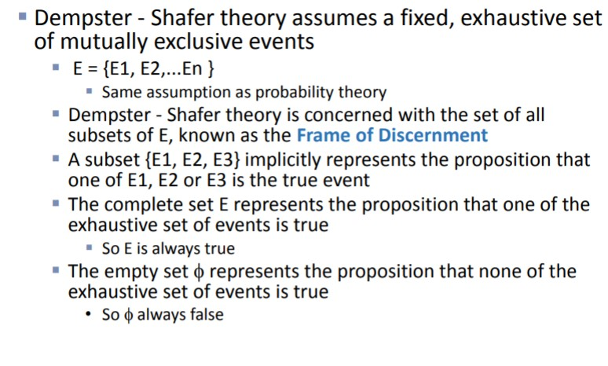
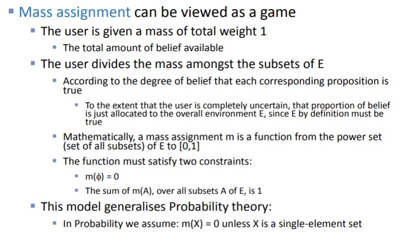
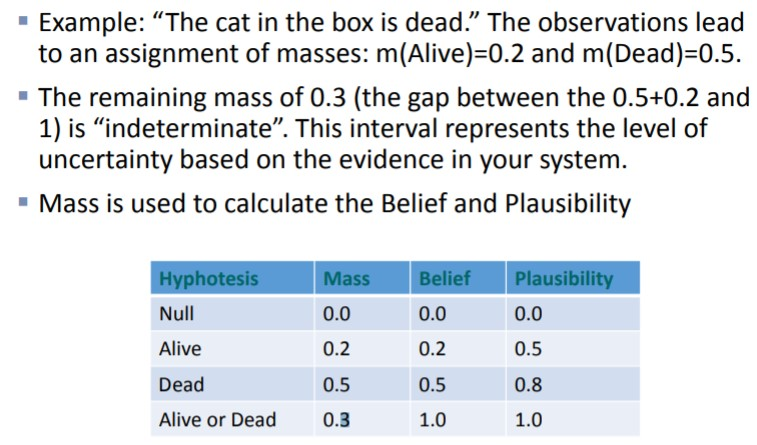
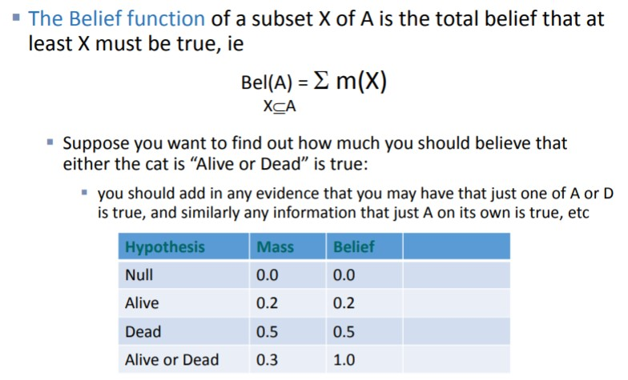
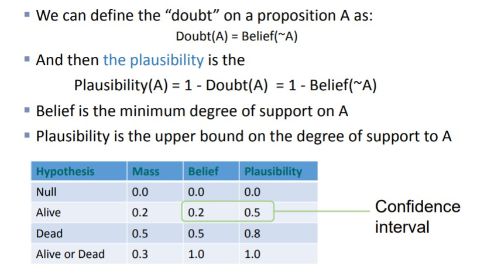
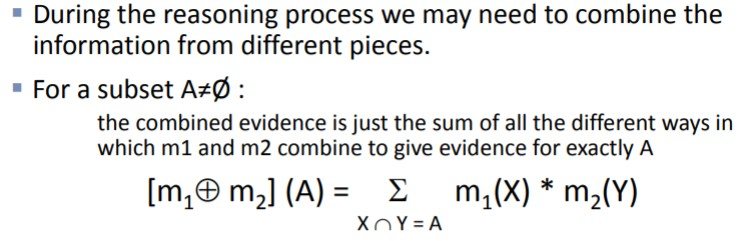
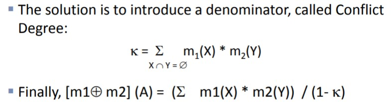
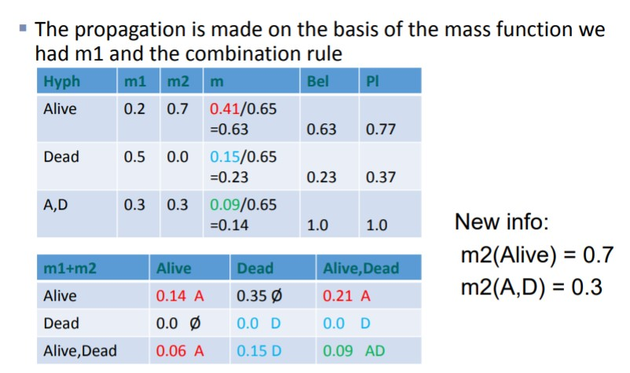

# Introduction to Evidence Theory: Dempster-Shafer model

Works with degrees of Belief and Plausability.

Models the way in which the beliefs are transmitted between the various hypotheses involved.

### Combining Evidence

But this method doesn't work so the solution is:

**Example of evidence combination**

## Summary

**Strong points**

Consistent, systematic treatment of lack of knowledge with confidence intervals.

Gives information about the uncertainty and also about the belief on the different hypothesis.

Several hypothesis are managed at the same time.

**Weak points**

Difficulty on designing the “mass assignment” function for each real problem.