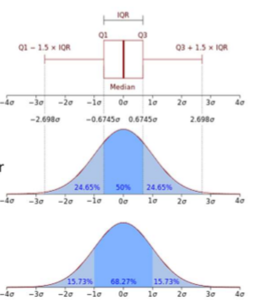
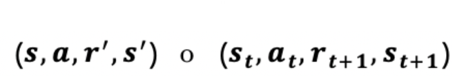
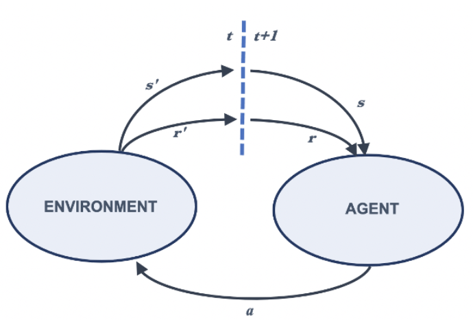
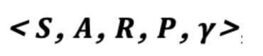
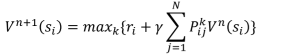
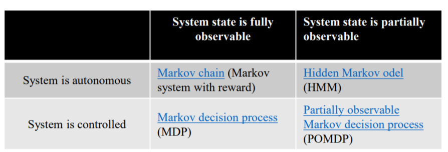

# Planning under uncertainty: MDPs and POMDPs

## Axioms of Probability

**Axiom 1**: The probability of an event is a real number greater than or equal to 0. 

**Axiom 2**: The probability that at least one of all the possible outcomes of a process (such as rolling a die) will occur is 1. 

**Axiom 3**: If two events A and B are mutually exclusive, then the probability of either A or B occurring is the probability of A occurring plus the probability of B occurring

A random variable is a numerical description of outcome of a statistical experiment.  A random variable that may assume only a finite number or an infinite sequence of values is said to be discrete. On that may assume any value in some interval on the real number line is said to be continuous.

The probability distribution for a random variable describes how the probabilities are distributed over the values of the random variable. For a discrete random variable, x, the probability distribution is defined by a probability mass function, denoted by f(x). This function provides the probability for each value of the random variable. In the development of the probability function for a discrete random variable, two conditions must be satisfied: 

 	1) f(x) must be nonnegative for each value of the random variable, and 
 	2) the sum of the probabilities for each value of the random variable must equal one.

Probability density function (**PDF**) is used to specify the probability of the random variable falling within a particular range of values.

## Markov 

***Note**: The following are in spanish because i'm too tired to translate*

Los agentes realizan acciones que representaremos con la letra **a** en la interacción entre el entorno y el agente en cada *time* *step*, que indicaremos con la letra **t**. En resumen, el agente y el entorno interactúan en una secuencia de *time* *steps* discretos, de manera que en un momento dado en el que el entorno se encuentra en un estado **s**, al realizar el agente una acción **a**, este recibe en el siguiente *time step* **t+1** una recompensa **r’** y el entorno cambia a un estado **s’**.

Podemos decir que un MDP consiste básicamente en una tupla de cinco elementos

Donde:

* S: un conjunto de estados
* A: un conjunto de acciones
* R: una función de recompensa
* P: función de transición
* y : factor de descuento

**Estados**

El conjunto de todos los estados posibles se llama espacio de estado y que puede llegar a ser infinito.

La probabilidad del siguiente estado, dado el estado actual y la acción, es independiente del historial de interacciones entre el entorno y el agente. Esta propiedad de los MDP, se conoce como **propiedad de Markov** *(Markov property)*y puede resumirse así: «la probabilidad de pasar de un estado ***s*** a otro estado ***s’*** en dos ocasiones distintas, dada la misma acción ***a***, es la misma independientemente de todos los estados o acciones anteriores encontrados antes de ese punto».

El futuro depende solo del presente y no del pasado,

**Acciones**

Puede haber estados con distintas acciones diferentes disponibles.

En cada estado, el entorno pone a disposición un conjunto de acciones, un **espacio de acción *A(s),*** del cual el agente elegirá una **acción**.

Dos tipus de espacios de acción:

* Discreto: Un **entorno discreto** es aquel cuyo espacio de acción es discreto. Por ejemplo, en el entorno Frozen-Lake, nuestro espacio de acción consta de cuatro acciones discretas: «izquierda», «abajo», «derecha» y «arriba».
* Continua: Un **entorno continuo** es aquel cuyo espacio de acción es continuo. Por ejemplo, cuando conducimos un automóvil, nuestras acciones tienen valores continuos, como la velocidad del automóvil o los grados que necesitamos para girar la rueda, etc.

**Función de transición**

Indica la forma en que el entorno cambia como respuesta a las acciones, representa la probabilidad de moverse de un estado a otro, y se denota por ***P***

El entorno responde al agente en el *time step t+1* del tiempo considerando solo el estado y la acción en el *time step t* anterior

P(*s'* | *s, a*)  el siguiente estado *s’* depende solo del estado anterior *s* y la acción *a*

**Recompensa**

Le da al agente retroalimentación sobre su comportamiento, y esa recompensa obtenida debe reforzar su comportamiento de una manera positiva o negativa

**Factor de descuento**

Debido a la posibilidad de secuencias infinitas de *time* *steps* en las tareas continuas, necesitamos una forma de descontar el valor de las recompensas a lo largo del tiempo. Este parámetro se denomina **factor de descuento** *(discount factor)*, y se denota con ***γ*** 

---

Process:

* Start in state *si*
* Receive immediate reward *ri*
* Choose action *ak* in A
* Change to state *sj* with probability *Pij*^k
* Discount future rewards

## Solving an MDP

* Find an action to apply to each state.
*  A policy is a mapping from states to actions.  
* Optimal policy - for every state, there is no other action that gets a higher sum of discounted future rewards.
* For every MDP there exists an optimal policy.  
* Solving an MDP is finding an optimal policy. 
* A specific policy converts an MDP into a plain Markov system with rewards.

## Value Iteration

Use a Bellman's Equation

## Choose one mode

## Summary

* MDP generalizes Graph representation
* POMDP generalizes MDP representation
* POMDP –representation of problems where the state of relevant variables is NOT fully known
* Solving POMDP can be represented as solving a Belief MDP (whose size is infinite though)
* Approximation techniques exist but intractability is still a huge issue for using POMDP planning in real world

