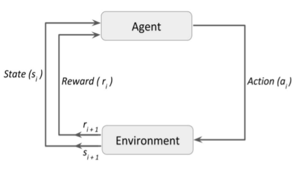
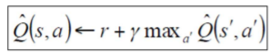
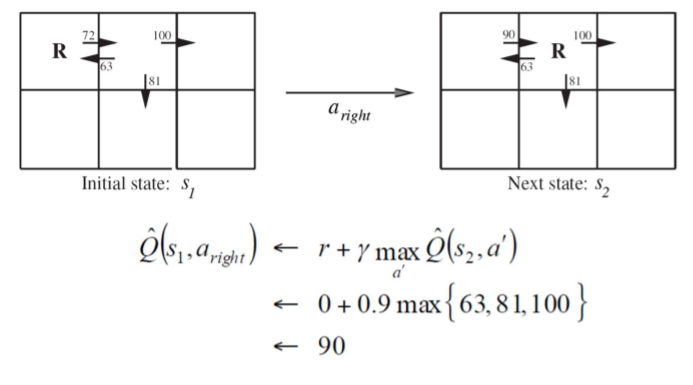
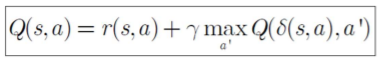
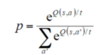

# Reinforcement Learning

## Learning types

* Learning from experience
* Supervised learning
  * Labelled examples
* Reinforcement Learning

## Reinforcement Learning

RL is learning from interaction with an environment to achieve some long-term goal that is related to the state of the environment (reward/punish). The goal is defined by reward signal, which must be maximized. Agent must be able to partially/fully sense the environment state and take actions to influence the environment state. The state is typically described with a feature-vector

* a: all possible moves that agent can take
* r: reward
* s: current state returned by environment
* π: policy. The tstrategy that the agent employs to determine next action based on the current state

## Online Learning Approaches

**RL** can be considered as Online learning which is a method of machine learning in which data becomes available in a sequential order and is used to update our best predictor for future data at each step, as opposed to batch learning techniques which generate the best predictor by learning on the entire training data set at once. 

**Online learning** is a common technique used in areas of machine learning where it is computationally infeasible to train over the entire dataset, requiring the need of out-of-core algorithm

### Categories of RL

* Model-based RL: MDP
* Model-free RL: Only concerns policy, Q-Learning
* Active Learning: Q-learning 

 ## Model-Based Reinforcement Learning

Approach:

* Learn the MDP
* Solve the MDP to determine optimal policy

### Learning the MDP

Estimate the rewards and transition distributions

* Try every ection some number of times
* Keep counts
* Solve using value or policy iteration

Iterative Learning and Action

* Maintain statistics incrementally
* Solve the model periodically

In MDP, Value Function determines how good it is for the agent to be in a particular state.

A policy is a simple function, that defines a probability distribution over Actions (a∈ A) for each state (s ∈ S). If an agent at time t follows a policy π then π(a|s) is the probability that agent with taking an action (a) at particular time step (t).

**What we mean when we say we are going to solve a Markov Decision Process?**

It means that we are going to find the Value Function that will satisfy the Bellman Equation. Once we have found the optimal value function, then we can use it to find the optimal policy

Dynamic programming assumes full knowledge of the MDP.

## Model-Free Reinforcement Learning

Learn policy mapping directly. Appropriate when model is too large to store, solve, or learn.

* Do not need to try every state/action in order to get good policy
* Converges to optimal policy

The model-based learning uses environment, action and reward to get the most reward from the action. The model-free learning only uses its state and reward to infer the best action

## Q-function

Is similar to Value-function, except that it takes an extra parameter, the current action (a).

where sʹ is the state resulting from applying action a in state s, and r is the reward that is returned

## Nondterministic Case

**Examples**

Backgammon 

* Action outcomes are probabilistic
* move involves roll of dice

Robotics

* Noisy sensors and effectors
* Appropriate to model actions and rewards as nondeterministic

Functions r(s,a) and δ(s,a) can be viewed as

* First producing a probability distribution over outcomes based on s and a and
* Then drawing an outcome at random according to this distribution

Nondeterministic Markov decision process

* When these probability distributions depend solely on s and a, i.e.,

### Recursive expression for  Q

## Exploration vs Exploitation

* Exploitation: High rewards from trying previously-well rewarded Actions
* Exploration: Which actions are best?  Must try ones not tried before

### Exploration Policy

* Wacky approach: act randomly in hopes of eventually exploring entire environment
* Greedy approach: act to maximize utility using current estimate
* Balanced approach: act “more” wacky when agent has not much knowledge of environment and “more” greedy when the agent has acted in the environment longer
* One-armed bandit problems

**Exploration Strategies**

* ε-greedy

  * Exploit with probability 1 - ε
  * Choose remaining actions uniformly
  * Adjust ε as learning continues

* Boltzman

  * Choose action with probability

  

Boltzmann exploration It's a classic strategy for sequential decision-making under uncertainty,

## Policy Reuse

The goal of Policy Reuse is to use different policies, which solve different tasks, to bias the exploration process of the learning of the action policy of another similar task in the same domain. We call Policy Library to the set of past policies, as defined next.

Policy Reuse is a reinforcement learning technique that efficiently learns a new policy by using past similar learned policies.

Policy Reuse needs that the past policies and the policy to be learned be defined in the same state and action spaces.

## Summary

* With RL we don’t need pre-labeled data. Just experiment and learn.
*  RL not used for choosing best pizza, but could be used to discover the steps to make the best pizza.