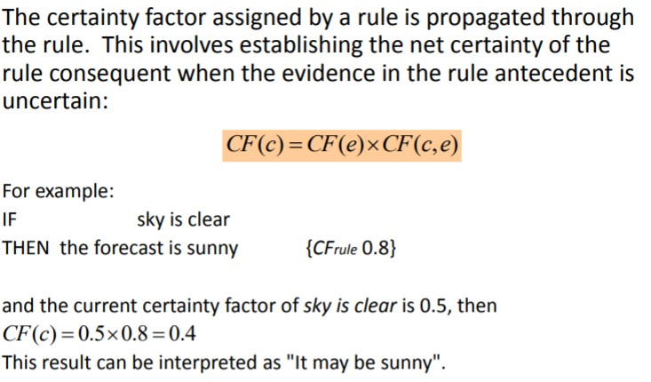

# Introduction Approximate Reasoning

Approximate reasoning deals with uncertainty and imprecision.

Sentences can be more or less imprecise.

If know that: “Temperature is above 20ºC”, what is the truth of the following sentences: 

	1. “Temperature is 25ºC”  &rarr; Precise and uncertain 
	1. “Temperature is higher than 15ºC” &rarr; Imprecise and certain

From a set of new evidences we have to calculate the truth of a some conclusions

### Models

* Probabilistic Approach
* Quasi-probabilistic methods: Certainty Factors
* Possibilistic Approach: Fuzzy Logic
* Existential Approach: Dempster-Shafer Theory

## Probability theory

It is a branch of Mathematics, and the basis of Statistics.

It deals with random variables (or stochastic processes), for which there is not a deterministic value.

So, there is some uncertainty about the true value of some variable.

Rules: evidences &rarr; conclusion (e &rarr; c)

1. Elements in C must be mutually independent. 
2. Elements in E must be conditionally.
3. A large number of input data is required (individual and conditioned probabilities), which makes it not feasible for some problems. 

When the evidences have several variables, it is not feasible to introduce all the conditional probabilities. So we assume conditional independence of the variables. 

## Certain factors

A quasi-probabilistic model that is founded on the classic probability theory.

It is based on calculating two measures:

* Measure of Belief: MB
* Measure of Disbelief: MD

### Combination rules

When the same consequent is obtained as a result of the execution of two or more rules, the individual certainty factors of these rules must be merged to give a combined certainty factor for a hypothesis.

***Note**: Check lab solved*

