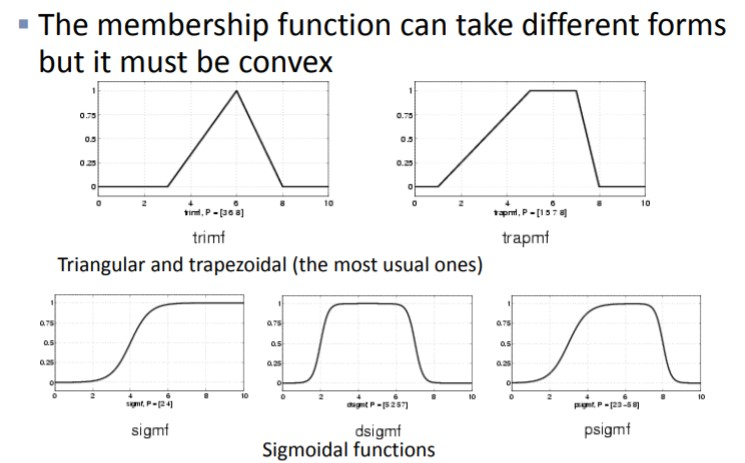
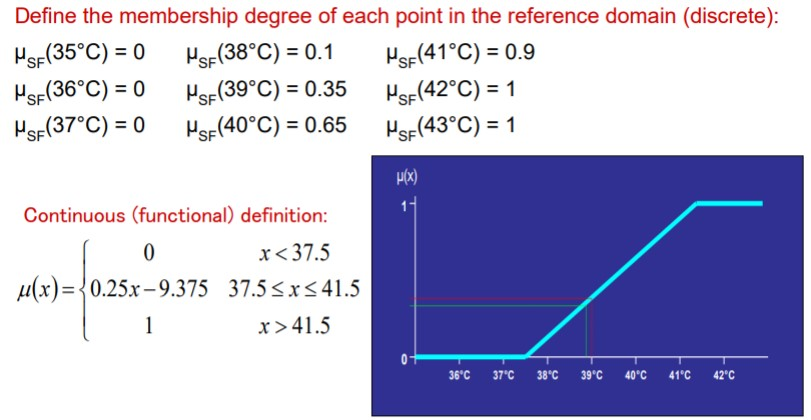
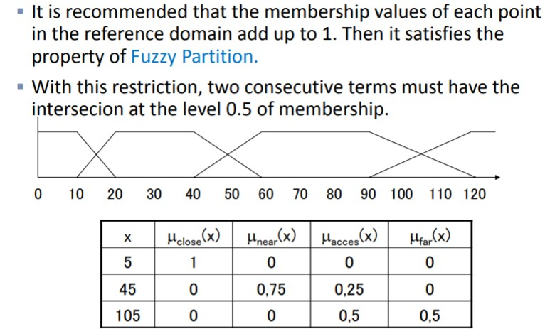
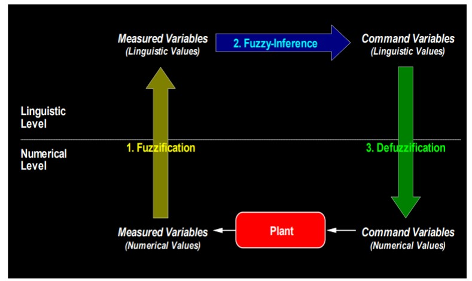
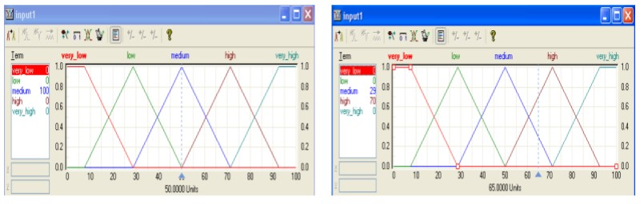
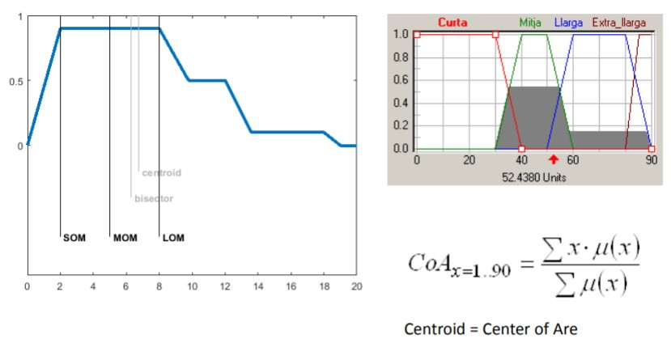

# Fuzzy Logic

Fuzzy sets: any object belongs to a set up to a certain degree, between 0 and 1. The membership function takes values in the real domain.

Membership function to define the degree of fulfillment of a predicate

## Operators

### Negation (Complement) : N(x)

* Boundaries : N(0) = 1 and N(1) = 0
* Monotonicity: if x < y then N(x) > N(y)
* Involution: N(N(x)) = x

The most known negation operator is:

* N(x) = 1-x

### Conjunction (intersection)  P(x) and Q(x)

This operator is called T-norm.

* Properties:
  * Commutativity: T(x,y) = T(y,x)
  * Associativity: T(x,T(y,z)) = T(T(x,y),z)
  * Monotonicity: if u<v and x<z then T(u,x)<T(v,z)
  * Neutrality: T(x,1)=x

### Disjunction (union): P(x) or Q(x)

This operator is called T-conorm.

* Properties:
  * Commutativity: S(x,y) = S(y,x)
  * Associativity: S(x,S(y,z)) = S(S(x,y),z)
  * Monotonicity: if u<v and x<z then S(u,x)<S(v,z)
  * Neutrality: S(x,0)=x

## Linguistic Variables

There is a fixed set of linguistic values for the variable: {short, medium, tall}

In fuzzy systems, each term has an associated fuzzy membership function on a reference domain (ºC)

# Fuzzy Expert Systems

Expert Systems are composed by a set of rules and an inference engine that determines how the rules are fired to obtain the final conclusion.

Rule-based system p1 & p2 & … & pn &rarr; q

Each premisse is satisfied at a certain degree

The conclusion is derived according to the degree of satisfaction of the premises. Many rules can be activated simultaneously, their conclusions are aggregated.

The conclusion is a fuzzy set that can be defuzzified into a numerical value.

Linguistic variables are used in the conditions and conclusion of the rules

**Example**

* If salary is high and the history is good then the risk is null.
* If salary is medium and the history is good then the risk is low.
* If salary is medium and history is bad then the risk is high.

## Fuzzification

The goal is to convert a numerical value into one or two linguistic values.

We find the membership degree to all the possible linguistic values.

Mamdami inference method evaluate the antecedent for each rule. Obtain each rule's conclusion and finally aggregate the conclusions. 

The membership degree of each of the input values is calculated for each linguistic variable.

Rules are usually conjunctive.  For conjunctive rules the aggregation operator must be a Tnorm: min or prod. In case of modeling a disjunctive rule, a T-conorm must be used: max or bounded sum (=probabilistic or).

The union of operators for fuzzy sets are T-conorms. The combination of T-norm min with T-conorm max is known as a Mamdani inference method. 

## Defuzzification

**Goal**: reduce fuzzy set into a single value in the reference domain. Consider the value of the domain with the highest membership value.

### Methods

* Centre of Area: average of all the values in the reference domain, which are weighted by the corresponding membership degree.

* Median of Maximum (MoM): median of the values that correspond to the linguistic term with maximum degree of membership.

* Others:

  *  Largest of Maximum (Lom): maximum x of the values that correspond to the term with maximum degree of membership
  * Smallest of Maximums (Som): minimum x of the values that correspond to the term with maximum degree of membership.

  

Method is evaluate the antecedent for each rules and obtain each rule's conclusion.  Aggregate conclusions and defuzzification. 

## Degree of support of the rules

Indicates the level of importance of the rule.

By default the degree is maximum (=1)

Other degrees can be used (from 0 to 1).

The degree of support must be multiplied by the degree of satisfaction of the antecedents in order to calculate the final degree of satisfaction of the rule.

### Drawbacks

* Variable selection is not trivial.
* A large number of rules must be defined.
* Changes in the domain must invalidate some rules.
* The systems are not easily adaptable.
* Experts spend many time in defining the system.
* Hierarchical fuzzy systems: the conclusions of one level are used in the following one. In this case the total number of rules decreases.
* Define the hierarchy of rules.
* Defuzzify or not conclusion before being used in the following rule block. 

